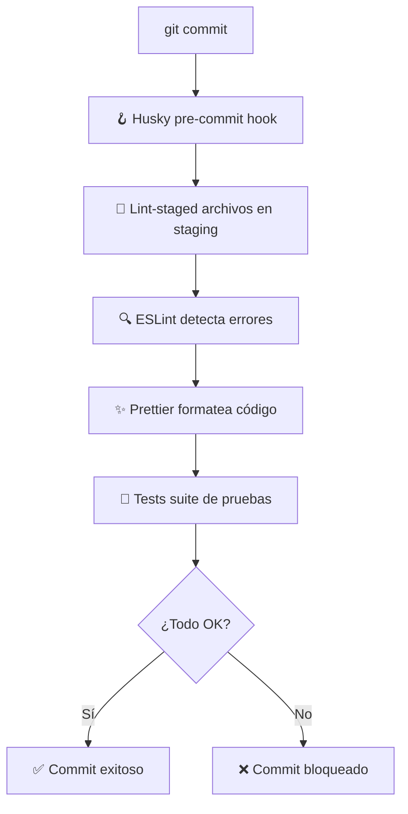

# TDD with React, Javascript, Material UI y React Query

Pequeño proyecto que consta de un login sencillo realizado con **TDD (Test-Driven Development)**, Material UI y React Query. El login realiza una petición contra el proyecto de la carpeta `user-management-be`, que consta de un server con Node y Express.

## 🛠️ Integración con ESLint, Prettier, Husky y Lint-staged

Este proyecto integra herramientas para mantener la calidad y consistencia del código:

### 🔍 ESLint vs Prettier

| Aspecto                  | ESLint                                  | Prettier                                         |
| ------------------------ | --------------------------------------- | ------------------------------------------------ |
| **Objetivo**             | Calidad de código y buenas prácticas    | Formato consistente del código                   |
| **Tipo de reglas**       | Lógicas (bugs, antipatrón, React hooks) | Estéticas (espacios, comas, saltos, indentación) |
| **Arreglos automáticos** | Algunos (fix)                           | Sí, casi todo el formato (write)                 |
| **Detección de errores** | Sí                                      | No                                               |
| **Ejemplos**             | `no-unused-vars`, `eqeqeq`, `jsx-key`   | `semi`, `quotes`, `tabWidth`, `printWidth`       |

### 🪝 Husky - Git Hooks

**¿Qué es?** Herramienta que permite ejecutar scripts automáticamente en eventos de Git (como commits, push, etc.).

**¿Para qué sirve?**

- ✅ Ejecuta linting y tests **antes** de cada commit
- 🚫 Previene que código con errores llegue al repositorio
- 🤖 Automatiza verificaciones de calidad sin intervención manual
- 👥 Mantiene estándares consistentes en el equipo

### 🎯 Lint-staged - Optimización

**¿Qué es?** Ejecuta linters solo sobre archivos que están en el área de staging (staged files).

**¿Para qué sirve?**

- ⚡ **Velocidad**: Solo procesa archivos modificados, no todo el proyecto
- 🎯 **Eficiencia**: Evita procesar archivos que no han cambiado
- 📋 **Granularidad**: Diferentes reglas para diferentes tipos de archivo
- 🔗 **Integración**: Funciona perfectamente con Husky

### 🔄 Flujo automatizado



### 🚀 Beneficios del setup

- **🎯 Calidad automática**: El código siempre mantiene estándares
- **🔒 Prevención temprana**: Errores detectados antes del commit
- **🎨 Consistencia**: Formato uniforme en todo el equipo
- **⚡ Sin esfuerzo**: Todo automático, sin pasos manuales
- **🚀 CI/CD preparado**: Código limpio desde el desarrollo

### 📋 Comandos disponibles

```bash
# 🔍 Linting
npm run lint          # Verificar errores
npm run lint:fix      # Arreglar errores automáticamente

# ✨ Formato
npm run format        # Formatear todos los archivos
npm run format:check  # Verificar formato sin modificar

# 🧪 Testing
npm run test          # Tests en modo watch
npm run test:ci       # Tests en modo CI (usado por Husky)
npm run test:coverage # Coverage report
```

### 🚦 ¿Cómo funciona en la práctica?

Cuando intentas hacer commit:

1. **Si hay errores de ESLint**: El commit se bloquea hasta que los corrijas
2. **Si hay warnings**: El commit continúa (configurable)
3. **Prettier formatea automáticamente**: Tu código queda con estilo consistente
4. **Tests fallan**: El commit se cancela hasta que los arregles

¡Tu código siempre estará limpio y testeado! 🎉
